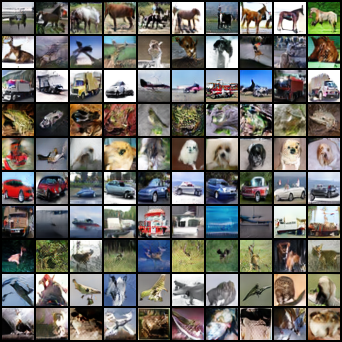
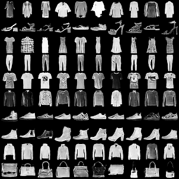
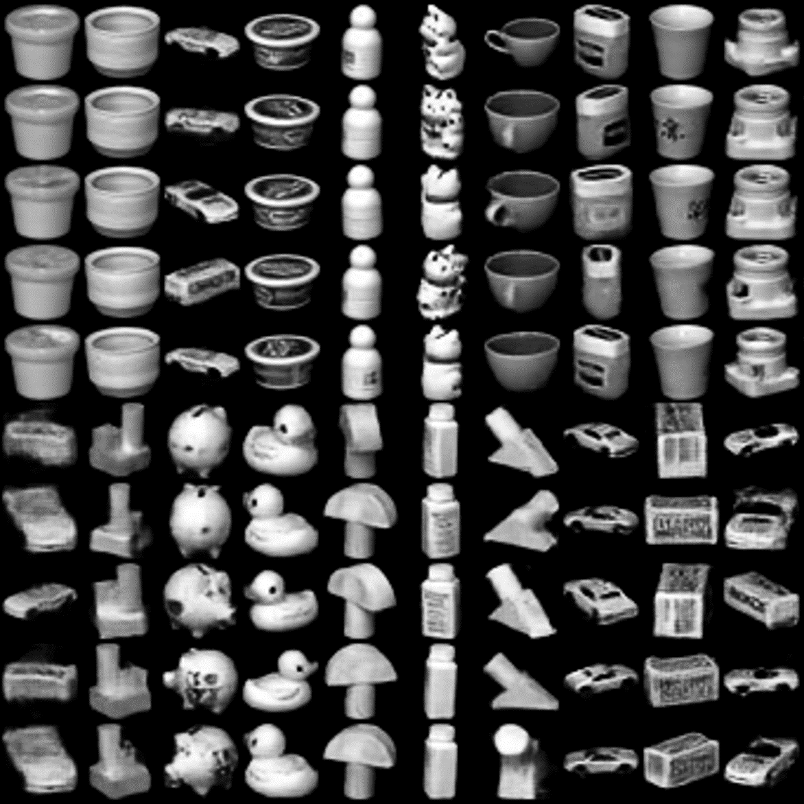

# 📖 CoDeGAN: Contrastive Disentanglement for Generative Adversarial Networks


> **CoDeGAN: Contrastive Disentanglement for Generative Adversarial Networks** <br>
> Jiangwei Zhao, Zejia Liu, Xiaohan Guo, Lili Pan <br>
> IEEE Transactions on Multimedia (submitted)

> **Abstract**: Disentanglement, as an important issue of interpretable AI, has attracted vast attention of computer vision community.
In contrast to VAE-based disentanglement, GAN-based disentanglement is extremely hard as GANs do not have explicit sample likelihood and forbidden posterior inference.  	
Most existing studies, such as InfoGAN and its variants, maximize the mutual information (MI) between an image and its latent codes to disentangle image variation in a unsupervised manner. 		
A major problem of these methods is that they force the network to generate the same images for the same latent factor and thus may seriously destroy the equilibrium  of GANs.
To alleviate this problem, we propose **Co**ntrastive **D**is**e**ntanglement for **G**enerative **A**dversarial **N**etworks (**CoDeGAN**), where we relax the domain of similarity constraints to be the feature domain rather than the image domain, so as to improve GANs equilibrium and constrain disentanglement.
Besides, we provide a theoretical analysis of why **CoDeGAN** can effectively alleviate GANs disequilibrium.
Furthermore, we introduce self-supervised pre-training into **CoDeGAN** for learning semantic representation to guide unsupervised disentanglement.
The extensive experimental results have shown that our method achieves the SOTA performance on multiple benchmarks.

<div align=center>

</div>


## 🔧 Dependencies and Installation


<!-- **Dependencies** -->

- Python 3.6.13
- Pytorch 1.7.1
- Numpy 1.19.2
- Option: TensorFlow 1.12.0

<!-- **Installation**

First, you can clone this repo using the command:

```shell
git clone https://github.com/learninginvision/CoDeGAN
```

Then, you can create a virtual environment using conda, as follows:

```shell
conda env create -f environment.yaml
``` -->

## 🗺 Dataset preparation

The MNIST, Fashion-MNIST and CIFAR-10 datasets needn't to be downloaded in advance, the code automatically downloads the data to directory ``"./dataset/<dataset_name>"`` during operation , if you download the data yourself, make sure they are on the same directory.

```
├── MNIST
│   └── raw
├── Fashion-MNIST
│   └── raw
├── CIFAR10
│   └── cifar-10-batches-py
├── CIFAR100
│   └── cifar-100-python
└── Coil-20
```


## 💻 Training

You can train your own models on the datasets mentioned, the few labels used in our experiments and the corresponding pretrained models are saved in directory ``"../<dataset_name>/few_labels"``, they are used only in few labels experiments. When selecting few labels images, we only make sure that the number of images for each class is equal, without additional filtering.

We also provide [pre trained model weights](https://drive.google.com/drive/folders/1KrIAhsEd3BOKAZOPIHJY3MW9-kw3oAgS?usp=sharing), you can download this file and unzip to base directory.

Each model can be trained by the following formats:


```bash
python train.py --config {config path}
```
Command-line arguments are as follows:

- `{config path}`: The path of config file.

Additionally, you can change the hyperparameters in the configuration file `./configs/*.yaml` to train the model.
After training, you can get model checkpoints in the folder `./Result/exp_name`, where `exp_name` is the name of the experiment (generated automatically), and the training log will be saved in the folder `./Result/exp_name/`.


## 💻 Metrics

- **ACC, NMI, ARI**

  The ACC, NMI, ARI are calculated by ``./test/test_acc_E.py`` in MNIST, Fashion-MNIST, and CIFAR-10, ``./test/test_acc_G.py`` in Coil-20, which will be calculated automatically during training, the test result will be saved in  ``./result/<rand int>/test_result.txt``.

- **IS, FID using Tensorflow**

  For IS and FID testing, we follow the work of [LDAGAN](https://github.com/Sumching/LDAGAN), the code is written by TensorFlow, if you want to calculate IS and FID score for CIFAR-10 experiments, you can do it by the following steps:

  In Pytorch environment:

  ```bash
  cd .utils/
  python sample_fake_images2npy.py
  ```
  and then:
  In TensorFlow environment:

  ```bash
  cd ./test/
  python test_IS&FID_tf.py
  ```

- **FID using PyTorch**

  We also provied the PyTorch version to calculate FID, using `clean-fid`. You can do it by the following steps:

  Running:

  In Pytorch environment:
  ```bash
  pip install cleanfid
  cd ./test/
  python test_FID_pt.py --model {model path} --config {config path}
  ```
  Command-line arguments are as follows:
  - `{model path}`: The path of the trained model.
  - `{config path}`: The path of config file.

## Result

<div align=center>


Qualitative comparison with state-of-the-art methods on the Fashion-MNIST, COIL-20 and CIFAR-10 datasets.
</div>

<div align=center>

Qualitative Result on CIFAR-10
</div>

<!-- <div align=center>

Qualitative Result on Fashion-MNIST
</div>


<div align=center>

Qualitative Result on COIL-20</div> -->

