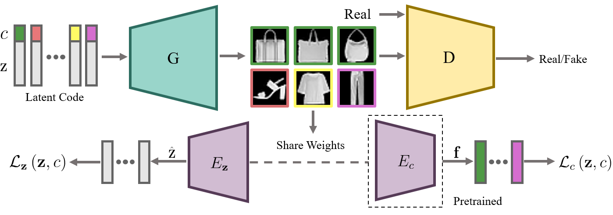
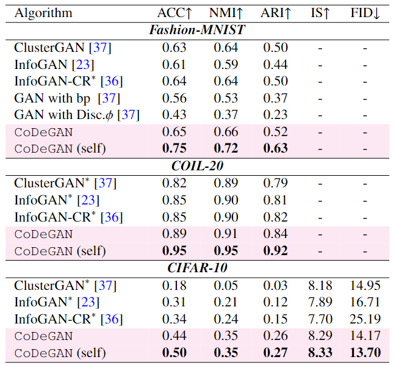

# CoDeGAN

Disentanglement, as an important issue of interpretable AI, has attracted vast attention of computer vision community. In contrast to VAE-based disentanglement, GAN-based disentanglement is extremely hard as GANs do not have explicit sample likelihood and forbidden posterior inference. Most existing studies, such as InfoGAN and its variants, maximize the mutual information (MI) between an image and its latent codes to disentangle image variation in a unsupervised manner. A major problem of these methods is that they force the network to generate the same images for the same latent factor and thus may seriously destroy the equilibrium of GANs. To alleviate this problem, we propose **Co**ntrastive **D**is**e**ntanglement for Generative **A**dversarial Networks (**CoDeGAN**), where we relax the domain of similarity constraints to be the feature domain rather than the image domain, so as to improve GANs equilibrium and constrain disentanglement. Besides, we provide a theoretical analysis of why CoDeGAN can effectively alleviate GANs disequilibrium. Furthermore, we introduce self-supervised pre-training into CoDeGAN for learning semantic representation to guide unsupervised disentanglement. The extensive experimental results have shown that our method achieves the SOTA performance on multiple benchmarks.

## Approach



## Dependencies

- Python 3.6.13
- Pytorch 1.7.1
- Numpy 1.19.2
- TensorFlow 1.12.0 `<is not must>`

## Datasets

The MNIST, Fashion-MNIST and CIFAR-10 datasets needn't to be downloaded in advance, the code automatically downloads the data to directory ``"./data/<dataset_name>"`` during operation , if you download the data yourself, make sure they are on the same directory.

## Training

You can train your own models on the datasets mentioned, the few labels used in our experiments and the corresponding pretrained models are saved in directory ``"../<dataset_name>/few_labels"``, they are used only in few labels experiments. When selecting few labels images, we only make sure that the number of images for each class is equal, without additional filtering.

We also provide [pre trained model weights](https://drive.google.com/drive/folders/1KrIAhsEd3BOKAZOPIHJY3MW9-kw3oAgS?usp=sharing), you can download this file and unzip to base directory.

Each model can be trained by the following formats:


```bash
python train.py --config <config path>
```
`<config path>` is the path if config file path, some config provided in `./configs/`


## Testing

- **ACC, NMI, ARI**

  The ACC, NMI, ARI are calculated by ``./<dataset_name>/test.py`` in MNIST and Fashion-MNIST, ``./<dataset_name>/test/test_acc.py`` in CIFAR-10, which will be calculated automatically during training, the test result will be saved in  ``./<dataset_name>/result/<rand int>/test_result.txt``.

- **IS, FID**

  For IS and FID testing, we follow the work of [LDAGAN](https://github.com/Sumching/LDAGAN), the code is written by TensorFlow, if you want to calculate IS and FID score for CIFAR-10 experiments, you can do it by the following steps:

  Opening  ``./utils/sample_fake_images2npy.py``

  Setting ``model_dir`` to be the directory where the final trained models are saved.

  In Pytorch environment:

  ```bash
  cd .utils/
  $ python sample_fake_images2npy.py
  ```

  In TensorFlow environment:

  ```bash
  cd ./test/
  $ python test_IS&FID_tf.py
  ```


  We also provied the PyTorch version to calculate FID, you can do it by the following steps:
  Running:

  In Pytorch environment:
  ```bash
  cd ./test/
  $ python test_FID_pt.py
  ```
## Result

<div align=center></div>
<div align="center">Qualitative comparison with state-of-the-art methods on the Fashion-MNIST, COIL-20 and CIFAR-10 datasets.</div>
